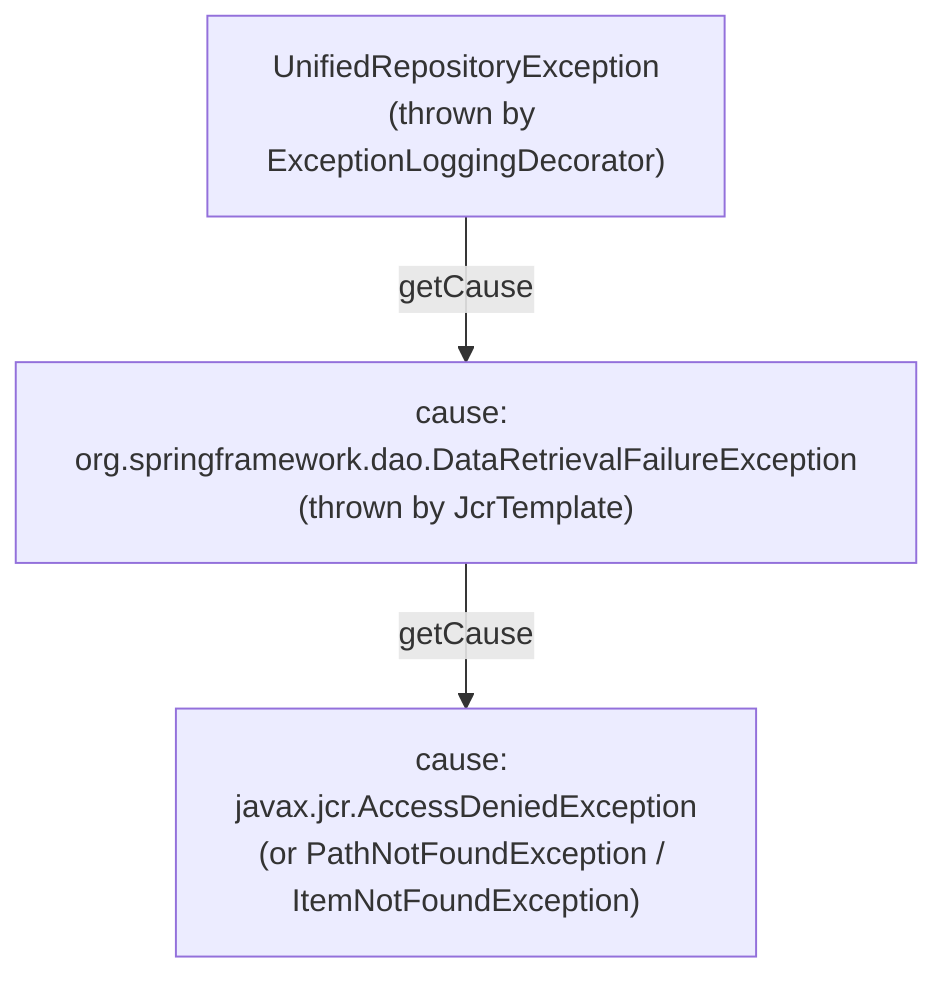

# `JcrTemplate` exception translation — the layer between the JCR session and `ExceptionLoggingDecorator`

> This layer is not mentioned in [JcrRepositoryFileDao layer](layer-jcr-repository-file-dao.md)/[Jackrabbit JCR session layer](layer-jackrabbit-jcr-session.md) above but is essential to understanding what
> `ExceptionLoggingDecorator` actually receives, and therefore what callers see.

Every DAO method body runs inside `jcrTemplate.execute(new JcrCallback() { ... })`
(`JcrTemplate` from `org.springframework.extensions.jcr`, the `se-jcr` library). The
`JcrCallback.doInJcr()` method is declared to throw the **checked** `javax.jcr.RepositoryException`.
`JcrTemplate.execute()` catches any `RepositoryException` escaping the callback and calls
`SessionFactoryUtils.translateException()`, which maps it — by `instanceof`, most specific
JCR exception type first — to an **unchecked** `org.springframework.dao.DataAccessException`
subtype, wrapping the original JCR exception as its cause. This translation applies **regardless
of whether the JCR exception was thrown natively by Jackrabbit or thrown explicitly by Pentaho
DAO code inside the callback** (e.g. the manual `throw new AccessDeniedException(...)` in
`deleteFile()` and `internalCopyOrMove()` — see [write operations — mixed behaviour](layer-jcr-repository-file-dao.md#write-operations--mixed-behaviour)).

The relevant mappings (from `SessionFactoryUtils.translateException()`):

| JCR exception (`javax.jcr.*`) | Translated to (`org.springframework.dao.*`) |
|---|---|
| `AccessDeniedException` | `DataRetrievalFailureException` |
| `PathNotFoundException` | `DataRetrievalFailureException` |
| `ItemNotFoundException` | `DataRetrievalFailureException` |
| `nodetype.ConstraintViolationException` | `DataIntegrityViolationException` |
| `ItemExistsException` | `DataIntegrityViolationException` |
| `ReferentialIntegrityException` | `DataIntegrityViolationException` |
| `version.VersionException` | `DataIntegrityViolationException` |
| `InvalidItemStateException` | `ConcurrencyFailureException` |
| `lock.LockException` | `ConcurrencyFailureException` |
| `LoginException` | `DataAccessResourceFailureException` |
| `NoSuchWorkspaceException` | `DataAccessResourceFailureException` |
| `query.InvalidQueryException` | `DataRetrievalFailureException` |
| `InvalidSerializedDataException` | `DataRetrievalFailureException` |
| `NamespaceException` / `nodetype.NoSuchNodeTypeException` / `UnsupportedRepositoryOperationException` / `ValueFormatException` | `InvalidDataAccessApiUsageException` |
| *(anything else)* | `org.springframework.extensions.jcr.JcrSystemException` |

> **Critical consequence:** `javax.jcr.AccessDeniedException`, `javax.jcr.PathNotFoundException`,
> and `javax.jcr.ItemNotFoundException` are **all three translated to the same class**,
> `org.springframework.dao.DataRetrievalFailureException`. At the `ExceptionLoggingDecorator`
> boundary, a write/delete-denial and a not-found/no-read condition that escapes the JCR
> callback are **indistinguishable by outer exception type alone** — the underlying JCR
> exception (available via `.getCause()` on the `DataRetrievalFailureException`) is the only
> way to tell them apart. See [IUnifiedRepository exception taxonomy](../../reference/unified-repository/exception-taxonomy.md) for how this plays out in the exception taxonomy and how to
> disambiguate.
>
> This translation only happens for exceptions that **escape the `JcrCallback`**. Several DAO
> methods (`internalGetFile`, `internalGetFileById`, `JcrRepositoryFileAclDao.hasAccess()`)
> catch `PathNotFoundException` / `ItemNotFoundException` **inside** the callback and convert
> them to a `null` / `false` return value before they ever reach `JcrTemplate` — for those
> methods no exception is thrown or translated at all (see [read operations — the not-found confounding pattern](layer-jcr-repository-file-dao.md#read-operations--the-not-found-confounding-pattern), [JcrRepositoryFileAclDao hasAccess layer](layer-jcr-repository-file-acl-dao.md)).

Because `org.springframework.dao.DataRetrievalFailureException` (and the other
`org.springframework.dao.*` types above) are **not** in the `ExceptionLoggingDecorator`
converter map ([ExceptionLoggingDecorator layer](layer-exception-logging-decorator.md)), they always fall through to the generic
`throw new UnifiedRepositoryException(message, e)` branch, where `e` is exactly the exception
`callLogThrow()` caught — i.e. the `DataRetrievalFailureException` itself, not the JCR
exception. This means:

i.e. the generic `UnifiedRepositoryException`'s **direct** cause is the Spring `dao` exception,
and the JCR exception is one level further down (`getCause().getCause()`), **not** the direct
cause. See [IUnifiedRepository exception taxonomy](../../reference/unified-repository/exception-taxonomy.md) for the corrected taxonomy and a snippet to unwrap this chain.

---

