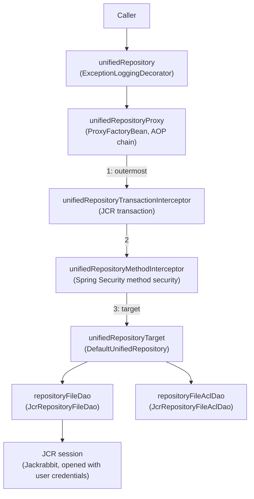

# Unified Repository Access Control Analysis

> Source files analysed:
> - `repository.spring.xml` – Spring bean configuration (AOP proxies, interceptors, ACL voters, ABS bindings)
> - `DefaultUnifiedRepository.java` – public API implementation
> - `ExceptionLoggingDecorator.java` – outermost `unifiedRepository` bean
> - `JcrRepositoryFileDao.java` – JCR DAO (file operations)
> - `JcrRepositoryFileAclDao.java` – JCR DAO (ACL operations)
> - `DefaultDeleteHelper.java` – JCR DAO helper for delete/undelete (source of `RepositoryFileDaoFileExistsException`/`RepositoryFileDaoReferentialIntegrityException`)
> - `RepositoryAccessVoterManager.java` – file-level voter manager

---

## Bean composition and call chain

AOP interceptors in `unifiedRepositoryProxy` are applied outermost-first:
the transaction interceptor starts the JCR transaction, then the method security
interceptor performs the ABS check, then the target method executes.

---

