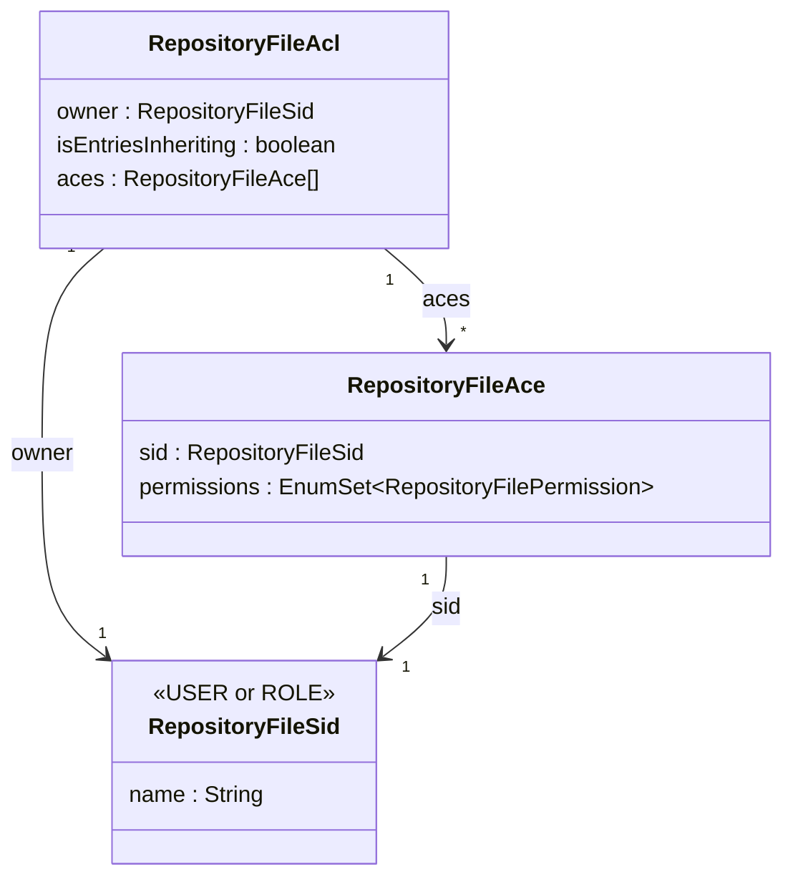

# ACL Model

## RepositoryFileAcl
- Attached to every node (file or folder).
- Has an **owner** (`RepositoryFileSid`).
- Has a list of **ACEs** (`RepositoryFileAce`): each ACE is a `(RepositoryFileSid, EnumSet<RepositoryFilePermission>)` pair.
- Has **`isEntriesInheriting`** flag (see Inheritance below).

## RepositoryFileSid
- Represents a user or role.
- Type: `USER` or `ROLE`.

## Stored in JCR
- ACL metadata (owner, entriesInheriting flag) stored as a special ACE entry via `AclMetadata` / `JcrRepositoryFileAclUtils`.
- The actual JCR ACL is stored using Jackrabbit's `AccessControlList` on the node path.

