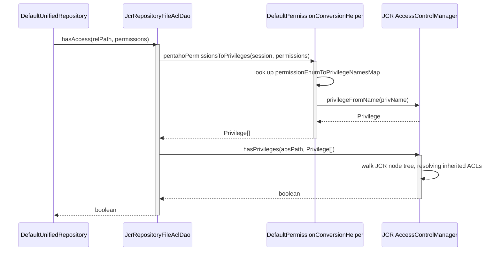

# Summary: Full Call Chain for `hasAccess`

```mermaid
sequenceDiagram
    participant DUR as DefaultUnifiedRepository
    participant AclDao as JcrRepositoryFileAclDao
    participant Helper as DefaultPermissionConversionHelper
    participant ACM as JCR AccessControlManager

    DUR->>AclDao: hasAccess(relPath, permissions)
    activate AclDao
    AclDao->>Helper: pentahoPermissionsToPrivileges(session, permissions)
    activate Helper
    Helper->>Helper: look up permissionEnumToPrivilegeNamesMap
    Helper->>ACM: privilegeFromName(privName)
    ACM-->>Helper: Privilege
    Helper-->>AclDao: Privilege[]
    deactivate Helper
    AclDao->>ACM: hasPrivileges(absPath, Privilege[])
    activate ACM
    ACM->>ACM: walk JCR node tree, resolving inherited ACLs
    ACM-->>AclDao: boolean
    deactivate ACM
    AclDao-->>DUR: boolean
    deactivate AclDao
```

