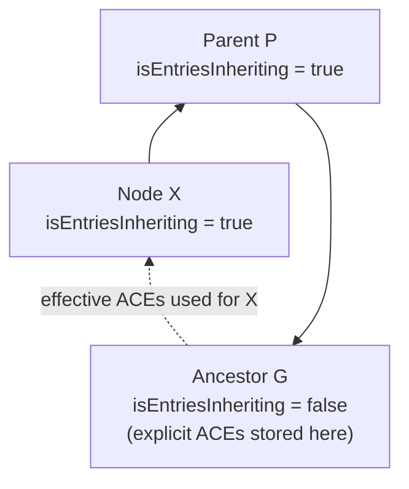

# Inheritance

- When `RepositoryFileAcl.isEntriesInheriting() == true`:  
  No explicit ACEs are stored for that node in JCR (only the metadata ACE — see Magic ACEs below).  
  `PentahoEntryCollector` walks up to the nearest non-inheriting ancestor and uses its ACEs.
- When `isEntriesInheriting() == false`:  
  The node has explicit ACEs stored in JCR. Jackrabbit uses them directly for privilege evaluation.

At check time, `session.getAccessControlManager().hasPrivileges(path, privs)` is called.  
**`PentahoEntryCollector`** (Jackrabbit's custom `EntryCollector`) intercepts this and injects Magic ACEs before returning the effective privilege set. See below.

## `getEffectiveAces(fileId, forceEntriesInheriting)`
- `forceEntriesInheriting=true`: walks up ancestor nodes collecting ACEs until it finds a node with `entriesInheriting=false`.
- Returns the merged effective set visible to the caller.

