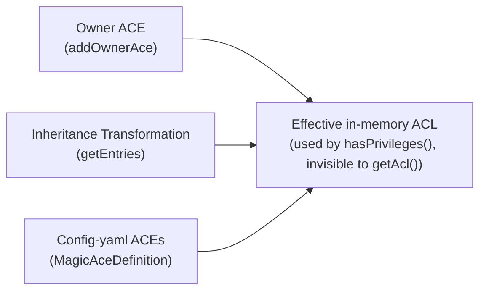

# Magic ACEs

Magic ACEs are **ephemeral ACEs injected at privilege evaluation time** by `PentahoEntryCollector`. They are **never persisted** to JCR. They exist only in memory during a `hasPrivileges()` call and are invisible to `getAcl()`.



There are three sources of Magic ACEs:

## Owner ACE (`addOwnerAce`)

Every node stores an **owner** in its ACL metadata (set during file/folder creation to the creating user).

When `hasPrivileges(nodeX, ...)` is evaluated:
- `PentahoEntryCollector` reads the owner from the first access-controlled ancestor of `nodeX`.
- The owner is injected as `MagicPrincipal` with **`jcr:all`** into the effective ACL (in-memory only).

**Effect:** The owner of any node always has `jcr:all` on it — including `jcr:removeNode`, `jcr:addChildNodes`, etc. — regardless of what the persisted ACEs say.

> **`jcr:all` ≠ Pentaho `ALL`.** `pho:aclManagement` is a custom privilege registered outside the JCR privilege tree. `jcr:all` does **not** include it. The owner magic ACE only injects `jcr:all`, so the owner does **not** automatically get `ACL_MANAGEMENT`. A node's owner can read, write, and delete it, but **cannot change its permissions** unless they also have an explicit `ALL` ACE on it (or are an admin).

## Inheritance Transformation (`getEntries`, lines 168–190)

When a node `nodeX` has `isEntriesInheriting=true`, its effective ACEs come from the nearest non-inheriting ancestor (e.g., parent folder `P`).

**Rule:** If `P`'s ACL contains an ACE with `jcr:removeChildNodes` but **not** `jcr:removeNode`, `PentahoEntryCollector` **injects `jcr:removeNode`** for that principal into the effective ACE set for `nodeX`.

```java
// PentahoEntryCollector.getEntries(), lines 168–190
if ( !currentNode.isSame( node ) ) {   // node inherits; currentNode = non-inheriting ancestor
    for ( AccessControlEntry entry : acl.getEntries() ) {
        if ( has jcr:removeChildNodes && NOT jcr:removeNode ) {
            acl.addAccessControlEntry( principal, [jcr:removeNode] );  // in-memory only
        }
    }
}
```

**Rationale (from source comment):** *"If we're inheriting from another node, check to see if that node has removeChildNodes or addChildNodes permissions. This needs to transform to become addChild removeChild."*

**Effect:** WRITE on a folder implicitly grants `jcr:removeNode` on all its inheriting children. A user with WRITE on folder `P` can delete any direct or indirect child that inherits from `P`.

**Asymmetry:** This injection only fires when the node is inheriting (`!currentNode.isSame(node)`). It does NOT fire when evaluating access on `P` itself. So WRITE on `P` lets you delete children of `P` but **not `P` itself**.

## Config-yaml Magic ACEs (`config.yaml` / `MagicAceDefinition`)

System-level RBAC-based ACEs loaded from `jcr/config.yaml` and injected dynamically for any user who holds the matching logical role. Not persisted.

| id | Logical Role | Privileges | Applies to |
|---|---|---|---|
| 0 | `org.pentaho.security.administerSecurity` | `jcr:all` | Tenant root + all children |
| 1 | `org.pentaho.repository.read` | `jcr:read`, `jcr:readAccessControl` | Tenant root itself + ancestors (NOT children) |
| 2 | `org.pentaho.repository.read` | `jcr:read`, `jcr:readAccessControl` | `/etc` + children (except `/etc/pdi/databases`) |
| 3 | `org.pentaho.repository.create` | `jcr:read`, `jcr:readAccessControl`, `jcr:write`, `jcr:modifyAccessControl`, `jcr:lockManagement`, `jcr:versionManagement`, `jcr:nodeTypeManagement` | `/etc` + children |
| 4 | `org.pentaho.security.publish` | same as id=3 | `/etc` + children |

> Config-yaml ACEs apply to the **`/etc` subtree and tenant root area only** — not to the general content tree (`/public`, user home folders, etc.).

